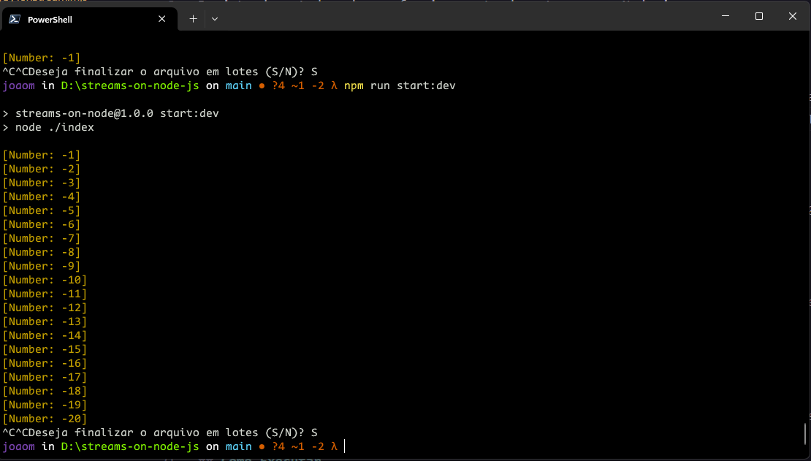

# 🔃 Streams on Node.js

Projeto de estudo sobre o funcionamento das streams no Node.js.

## Conceitos de Streams

Streams são uma abstração poderosa para trabalhar com dados de maneira eficiente e assíncrona. Em vez de manipular grandes conjuntos de dados de uma vez, as streams permitem processar dados em pequenos pedaços, chamados de "chunks". Isso é especialmente útil ao lidar com grandes volumes de dados ou operações de (I/O).

## Principais tipos:

1. **Readable Streams:**
   - Representam uma fonte de dados que você pode ler.
   - Emitem eventos como `data` quando há dados disponíveis para leitura.

2. **Writable Streams:**
   - Representam um destino para o qual você pode escrever dados.
   - Emitem eventos como `drain` quando estão prontos para aceitar mais dados.

3. **Transform Streams:**
   - São uma combinação de streams de leitura e gravação.
   - Permitem modificar ou transformar dados enquanto são transferidos de uma fonte para um destino.

## Streams usadas no projeto:

#### 1. `OneToHundredStream` (Readable)

   - Esta stream é uma fonte de dados que gera números de 1 a 100 em intervalos de 1 segundo.
   - Utiliza o método `_read()` para gerar os números e `push` para enviá-los para a próxima etapa da cadeia de streams.

#### 2. `InverseNumberStream` (Transform)

   - Esta stream transforma os números lidos por `OneToHundredStream` multiplicando-os por -1.
   - Utiliza o método `_transform()` para realizar a transformação.

#### 3. `MultiplyByTenStream` (Writable)

   - Esta stream recebe os números transformados por `InverseNumberStream` e os multiplica por dez.
   - Utiliza o método `_write()` para processar os chunks de dados recebidos.

### ✅ Benefícios de Streams

- **Eficiência de Memória:**
  - As streams permitem processar dados em pequenos pedaços, evitando a carga desnecessária de grandes conjuntos de dados na memória.

- **Assincronicidade:**
  - As operações em streams são assíncronas, o que significa que você pode continuar a executar outras tarefas enquanto processa dados.

- **Manuseio de Grandes Volumes de Dados:**
  - São ideais para lidar com grandes volumes de dados ou operações de I/O, como leitura/gravação de arquivos.


## 🚀 Como Executar

Siga as instruções abaixo para executar o projeto:

```bash
# Clone o projeto
$ git clone https://github.com/joaomacedx/streams-on-node-js.git
$ cd streams-on-node-js

# Instale as dependências
$ npm install

# Execute as streams
$ npm run start:dev
```




